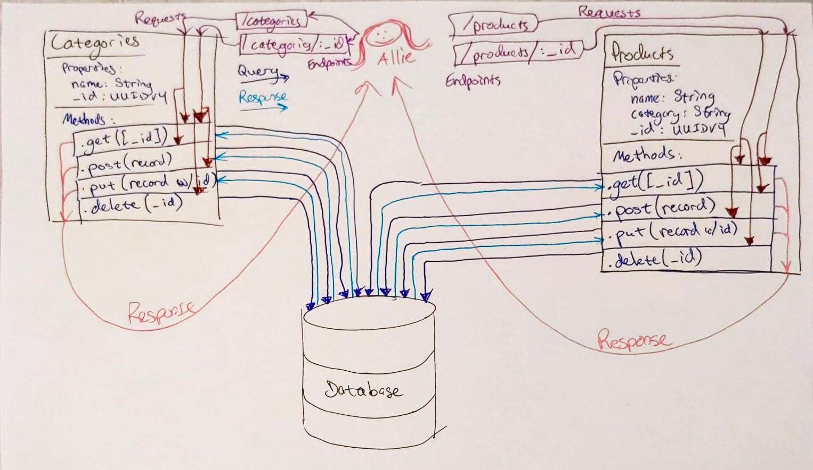

# LAB - 08

## Data Modelling and Database Handling

### Author: Jesse Van Volkinburg

### Links and Resources
* [submission PR](https://github.com/401-advanced-javascript-jv/08-data-modeling/pull/1)
* [travis](https://www.travis-ci.com/401-advanced-javascript-jv/08-data-modeling)

### Modules
#### `categories.js`
##### `Categories`
Categories class, used for Mongo database access. Provides CRUD functionality.

###### `.get([_id])`
Returns contents of categories collection.
When called with `_id` as a parameter, will provide information about only that item.

###### `.post({name: String})`
Adds a category to the database.
Example: `Categories.post({name: 'Books'});` adds a category named 'Books'

###### `.put(_id, {...})`
Changes the details of the category with the given id.

###### `.delete(_id)`
Deletes the category specified by the given id.

### Setup
#### `.env` requirements
* `PORT` - Port Number for the server
* `MONGODB_URI` - URL to the running mongo instance/db

#### Running the app
* `npm start`
* Endpoint: `/categories`
* Endpoint: `/products`
  * `GET` - Returns a JSON object with a list of catgories/products in it.
  * `POST` - Adds the item to the database and return a JSON object with the category's details.
* Endpoint: `/categories/:id`
* Endpoint: `/products/:id`
  * `GET` - Returns a JSON object with a category/product specified by `:id` in it.
  * `PUT` - Updates the category/product with the given `:id`, and returns a JSON object with the updated details.
  * `DELETE` - Deletes the product and returns a JSON object with the deleted product's details.
  
#### Tests
* `npm test` to run tests
* Assertions made:
  ✓ can post() a new category (4ms)
  ✓ can get() all categories (6ms)
  ✓ can get() a single category by id (1ms)
* What assertions need to be / should be made?
  x can put()/update a category (1ms)
  x can delete() a category from the database
  x can post() a new product
  x can get() all products
  x can get() a single product by id
  x can put()/update a product
  x can delete() a product from the database

#### UML
